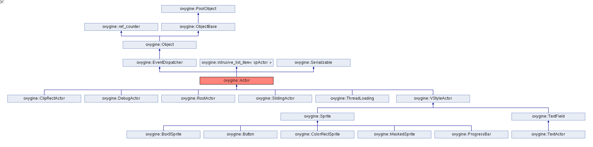
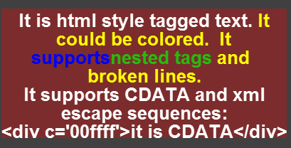

#Scene Graph
Low level 2D frameworks provides you basic rendering functionality. Where you should draw images each frame by hands.
 
Oxygine isn't low level 2D framework and in addition to this it provides own scene graph.

##Example
You could create Sprite, set position and image, attach it to scene and "forget". Sprite would be displayed and updated each frame automatically. You could say to this sprite "rotate on 360 degrees for 2 seconds 5 times and then remove self".

	spSrite sprite = new Sprite;
	sprite->attachTo(getStage()); 
	sprite->addTween(Sprite::TweenRotation(2*PI), 2000, 5)->setDetachActor(true);

> it is pseudocode, you also should set to sprite "image" resource or it would be empty and invisible  
> getStage() returns root node of the scene graph

You could create second *"child"* sprite attached to already created and they would be rotating both:

	spSprite child = new Sprite;
	child->attachTo(sprite);

   
 
 

 
 
#Actors
Actor is base class in scene graph. 
Actor has properties:

- transformation (position, scale, rotation)
- size
- name
- list of children
- list of added tweens 
- etc.

You would widely use Sprites in your app.

##Sprite
Sprite is main Actor for displaying images and animations. Sprite = Actor + Image

##Polygon
Sprite for rendering custom vertices array. Polygon = Sprite + Vertices 

##TextField
TextField is used for displaying text.

##Progress Bar
Progress Bar is used for displaying progress.

##ColorRectSprite
It is rectangle filled with one color.

##ClipRectActor
ClipRectActor is clipping outside children.

##MaskedSprite
Sprite which is using other sprite for masking own children.

