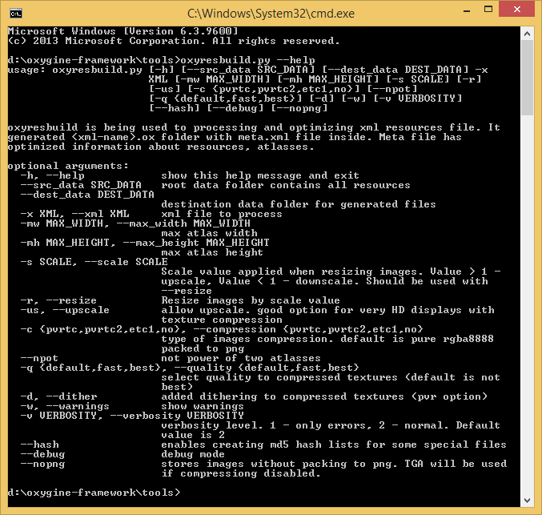

#Atlasses

If you wish to use a third-party tool for packing images into atlasses, for example TexturePacker, then you may use the Oxygine-supported Starling/Sparrow format. See [Resources article](resources) #Starling

However, if you wish to experience everything Oxygine has to offer, then you should use the utility oxyresbuild. Look below for details.

##Building Atlasses with Oxygine
All decals in the xml resource files in the <atlas> group automatically turn into atlases upon loading the xml files.
	
	<atlas>
	    <image file="close.png" />
	    <image file="button.png" />     
	    <image file="anim/run.png" />
	</atlas>

It is possible to decrease the loading times and memory usage of a game if you prebuild the atlases with special tool.
> as it essentially creates a single image with another marking file instead of many individual images. This results in quicker loading times and saves memory.

For this, Oxygine posesses a special utility command called **"oxyresbuild"**, which located in the tools folder:

	oxygine-framework/tools/oxyresbuild.py

To use this tool, you will need to install Python. Read how to do so below:
		
[oxygine-framework/tools/readme.txt](https://bitbucket.org/oxygine/oxygine-framework/src/tip/tools/readme.txt?at=tip)

In examples/Game/Part5 there are examples on how to use it. Look at the shell scripts for more details. For example, examples/Game/part5/gen-atlasses.bat:

	python ../../../tools/oxyresbuild.py -x xmls/ui.xml --src_data data --dest_data data

its result is located in the following folder:

	oxygine-framework/examples/Game/part5/data/ui.xml.ox/

Also, in Game/Part5 the folder with the source images is outside of the data folder, as it is not needed in the final compiled version of the application.

##HD Assets

Source artwork is usually saved in high resolution to support HD displays.
 
For example, an artist used 2048x1536 resolution as a basis for source images, but the game is displayed at 1024x768.
The artist made a background which needs to be displayed in the game, so we add it to our resources.xml file:

	<atlas>
	    <image file="background.png" />
	</atlas> 

Now, let's create it in code:

	spSprite sprite = new Sprite;
	sprite->setResAnim(res.getResAnim("background"));
	sprite->attachTo(getStage());

The sprite will be too large for the display, so we will need to make it smaller:

	float scaleFactor = 1024.0f / 2048.0f; // =0.5f
	/* or
	float scaleFactor = getStage()->getWidth() / (float)sprite->getWidth()	
	*/
	sprite->setScale(scaleFactor);

Similar *setScale* calls will need to be done on every created sprite that is saved in high resolution. However, we can make our job easier by specifying everything in the xml file with scale_factor:

	<set scale_factor = "0.5f" />

 	<atlas>
	    <image file="background.png" />
	</atlas>

This way the code will simplify to the way it was before: 
	
	spSprite sprite = new Sprite;
	sprite->setResAnim(res.getResAnim("background"));
	sprite->attachTo(getStage());

while the sprite will be displayed in proper resolution (1024x768), and will fully fit on the screen:

	sprite->getWidth () == 1024
	sprite->getHeight() == 768 

The source image, however, will still be stored at 2048x1536 and will therefore take up more memory. To avoid this, we generate an atlas for xml with the help of *oxyresbuild* with the argument **-r**:

	python path/to/oxyresbuild/oxyresbuild.py -x resources.xml --src_data data --dest_data data -r

**-r** is short for **--resize**, which means that before the creation of an atlas the image needs to be resized according to scale_factor. This way atlas receives an image which is 2 times smaller.

We can also lower the size of the image in atlas by adding the argument **-s**:

	python path/to/oxyresbuild/oxyresbuild.py -x resources.xml --src_data data --dest_data data -r -s 0.625

**-s** is short for **--scale**. When it is 0.625, the image needs to the rescaled by a factor of 0.625 before being loaded in. This way the atlast receives the image of the following scales:

	w = 2048 * 0.5 * 0.625 = 640
	h = 1536 * 0.5 * 0.625 = 480

However, the size of the Sprite will remain the same:

	sprite->getWidth () == 1024
	sprite->getHeight() == 768 

We can also increase the size of an image in atlas by setting the argument **-s** > 1:
	
	python path/to/oxyresbuild/oxyresbuild.py -x resources.xml --src_data data --dest_data data -r -s 1.25 

This way atlas receives the images of the following sizes:

	w = 2048 * 0.5 * 1.25 = 1280
	h = 1536 * 0.5 * 1.25 = 960

