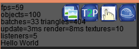

##DebugActor 
DebugActor displays some useful stats. Some of them available only in Debug mode:

- **fps** - frames per second
- **objects** - number of created instances of Object. Debug only, to enable it in release define OXYGINE_DEBUG_TRACE_LEAKS
- **batches** - number of batches per frame (draw calls). Debug only, to enable it in release define OXYGINE_TRACE_VIDEO_STATS
- **triangles** - number of triangles per frame
- **update** - RootActor::update time in milliseconds. It includes all children updates
- **render** - RootActor::render time in milliseconds. It includes all children rendering
- **textures** - number of total created textures
- **listeners** - number of event listeners attached to RootActor

###Custom text
To display custom text on DebugActor (image above) call it each frame:

    DebugActor::instance->addDebugString("Custom text");

###Tools
**DebugActor** has 4 buttons from left to right:

1. **Textures inspector** shows all created and not deleted textures. Debug only, to enable it in release define OXYGINE_DEBUG_TRACE_LEAKS
2. **T2P** - Texel2Pixel. It shows "blurred" sprites displayed without texel to pixel precision on display
3. **Finger** - Animates clicked actors under mouse cursor. Could be useful to find out who blocked mouse events
4. **Tree Inspector** show graph tree of actors with detailed info.

#Logging
**namespace log** has functions to print text to output. Include **log.h**  by entering #include "core/log.h". 
> If using Visual Studio 2013, make sure to open the Output window (View > Output) and set it to show output from Debug after compilation to view the messages.

    log::messageln("it is message");
    > it is message
    
    log::warning("it is warning");
    > warning: it is warning
    
    log::error("it is error");
    > error: it is error

#Tracing Object leaks
Helps you to find leaked Objects.
 
> It is Debug only feature, to enable it in release mode define: OXYGINE_DEBUG_TRACE_LEAKS

Guards to trace leaks:

	ObjectBase::__startTracingLeaks();
    new Actor;//leak
	new Sprite;//leak
	ObjectBase::__stopTracingLeaks();

If you want to display all created and not deleted Objects call:

	ObjectBase::dumpCreatedObjects();

result: 

	allocated objects:
	id = 3, name = '', typeid = 'class oxygine::Actor', refs = 0
	id = 4, name = '', typeid = 'class oxygine::Sprite', refs = 0
	total: 2 -----------------------------

There are some useful functions:

		/**Shows assert when object with this unique ID will be created.*/ 
		ObjectBase::showAssertInCtor(int id);
		/**Shows assert when object with this unique ID will be destroyed.*/
		ObjectBase::showAssertInDtor(int id);

**"id"** is numeric identifier which could be retrieved from "allocated objects" list 

> Each example has leak guards (entry_point.cpp)
