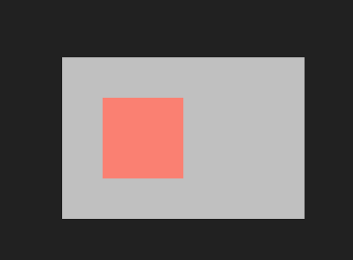
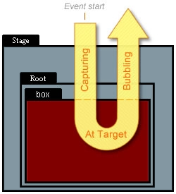
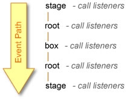
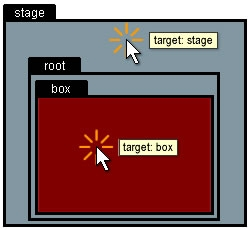
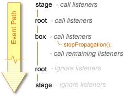
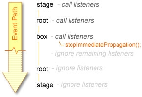

#Events
Oxygine has events model taken from Adobe Flash (as3).
This article is based on as3 article about events: [http://www.adobe.com/devnet/actionscript/articles/event_handling_as3.html](http://www.adobe.com/devnet/actionscript/articles/event_handling_as3.html)

 

##EventDispatcher class

Event handling in Oxygine depends heavily on the EventDispatcher class. 

For those not familiar with EventDispatcher, the basic concept is this: 
First you define functions (methods), or event handlers, to react to various events. Then you associate those functions with the events by using the addEventListener() method, which is called from the object that will receive the event. 

The code using EventDispatcher looks like this:

	void clickHandler(Event*) {}
	submitButton.addEventListener(TouchEvent::CLICK, CLOSURE(this, &SomeClass::clickHandler));

Using EventDispatcher, you use removeEventListener(). This method removes an event listener that matches the same definition used in addEventListener (up to the third parameter).

	submitButton.removeEventListener(TouchEvent::CLICK, CLOSURE(this, &SomeClass::clickHandler));

##Where is EventDispatcher?
You may have noticed that the code snippets above do not explicitly reference EventDispatcher. In fact, it's rare that you would ever use EventDispatcher directly in your code. EventDispatcher, in Oxygine, is actually a base class, which other classes extend in order to be able to have access to addEventListener and other EventDispatcher methods. 

##EventDispatcher methods
Here is a summary of the methods in EventDispatcher:

	int addEventListener(eventType type, EventCallback callback); 
	void removeEventListener(eventType type, EventCallback callback);
	void dispatchEvent(Event *event);

* **addEventListener**: Adds an event handler function to listen to an event so that when that event occurs, the function will be called.
* **removeEventListener**: Removes an event handler added to a listeners list using addEventListener. The same first 2 arguments used in addEventListener must be used in removeEventListener to remove the correct handler.

> there are other simplified versions of removeEventListener

* **dispatchEvent**: Sends the passed event to all listeners in the listeners list of an object that relates to the event type. This method is most commonly used when creating custom events.

###Example 1: Clicking a box
As a simple example, consider clicking on a square instance named "box" on the screen. The goal of this example is to handle that event so that the text "click" is traced in the Output panel when the box is clicked with the mouse.

	class Root : public ColorRectSprite
	{
	public:
		void clickHandler(Event*)
		{
			log::messageln("click");
		}
	
		Root()
		{
			setSize(300, 200);
			setPosition(getStage()->getSize() / 2 - getSize() / 2);
			setColor(Color::Silver);
			spColorRectSprite box = new ColorRectSprite;
			box->setColor(Color::Salmon);
			box->setPosition(50, 50);
			box->setSize(100, 100);
			addChild(box);
	
			box->addEventListener(TouchEvent::CLICK, CLOSURE(this, &Root::clickHandler));
		}
	};

To test this code example, do the following:

* open HelloWorld example
* copy paste code to example.cpp
* add this code to example_init function:

	getStage()->addChild(new Root);

Let's take a look at the code. The first step is to define the event handler (listener function). As with all events, this accepts in its parameter list a single event instance that's automatically passed into the function when called from an event dispatcher. After that, the function is set as a listener to the box instance-the event dispatcher-listening for a *TouchEvent::CLICK* event using a basic addEventListener call. Since the box is an instance of ColorRectSprite it inherits from EventDispatcher and has access to all the EventDispatcher methods, including addEventListener.

*TouchEvent::CLICK* is a constant variable defined in the TouchEvent class. It simply provides the unique integer idendifier of the event. Other event types are also stored in similar constants in the TouchEvent class, as well as other event-related classes. 

Testing the example will display a clickable box that, when clicked, traces the word "click".

###Event propagation and phases

Although you might not have realized it in the previous example, the event that took place as a result of the box being clicked actually affects many different objects, not just the object being clicked. Event handling is the support for event propagation—the transference of a single event applying to multiple objects. Each of those objects receives the event, instead of just the object in which the event originated.

With event propagation you're dealing with three "phases" of an event. Each phase represents a path or the location of an event as it works itself through the display objects in Oxygine that relate to that event. The three phases of an event are capturing, at target, and bubbling:

* **Capturing phase**: This represents the parent objects of the target object from which the event originated. Any propagated event starts with the topmost parent (stage) and works down the display object hierarchy until reaching the original target.
* **At target phase**: The target phase is the phase where the event is at the target object or the object from which the event originated. Unlike the capturing and bubbling phases, this phase always relates to only one object, the target object.
* **Bubbling phase**: When an event "bubbles" it follows the reverse path of the capturing phase and works its way back up the parent hierarchy of the target object until reaching the top-most parent or stage.
Not all propagated events (and not all events propagate) go through each phase, however. If the Stage object, for example, receives an event, there will only be an at target phase since there are no objects beyond the stage for the capturing or bubbling phases to take place.

As the event makes its way though each phase and each object within those phases, it calls all of the listener functions that were added for that event. This means that clicking on the box doesn't limit the event to the box; the Stage also receives the event. 

You can see how this all works more clearly by adding more listeners to our example.

###Example 2: One box, many listeners

To see how a single mouse click propagates through many objects within the display list hierarchy, you can add additional listeners to receive the event for each of those objects it affects. 

In this example we will add listeners for Stage, Root, and box. 

Clicking the box propagates the events throughout all specified listeners for all phases

	class Root : public ColorRectSprite
	{
	public:
		void boxClick(Event*)
		{
			log::messageln("box click");
		}
		void rootClick(Event*)
		{
			log::messageln("root click");
		}
		void stageClick(Event*)
		{
			log::messageln("stage click");
		}
		Root()
		{
			setSize(300, 200);
			setPosition(getStage()->getSize() / 2 - getSize() / 2);
			setColor(Color::Silver);
			spColorRectSprite box = new ColorRectSprite;
			box->setColor(Color::Salmon);
			box->setPosition(50, 50);
			box->setSize(100, 100);
			addChild(box);
	
			getStage()->addEventListener(TouchEvent::CLICK, CLOSURE(this, &Root::stageClick));
			box->addEventListener(TouchEvent::CLICK, CLOSURE(this, &Root::boxClick));
			this->addEventListener(TouchEvent::CLICK, CLOSURE(this, &Root::rootClick));
		}
	};

Test this example and click around to see the results. Clicking on the box should give you the following output:

	box click
	root click
	stage click

Try clicking anywhere off of the *box* and you get an output of:

	root click
	stage click

or:

	stage click

##Event targeting

All events, like mouse clicks, start off in Oxygine with the process of event targeting. This is the process by which Oxygine determines which object is the target of the event (where the event originates). In the previous examples we've seen how Oxygine was able to determine whether or not you clicked on the box or the Stage. For every mouse event, the event references one object—the object of highest arrangement capable of receiving the event.

All display objects are, by default, enabled to receive touch events. This means that even if no event handlers have been assigned to a particular actor, it will still be targeted for an event when clicked, preventing anything below it from receiving events.

To change this behavior use the *setTouchEnabled* setter. Setting it to false will disable an acotr instance from receiving touch events and allows other instances below it to be targeted for touch  events:

	sprite->setTouchEnabled(false);

###Event objects
Event objects are the objects listener functions receive as an argument when called during the occurrence of an event. 

The event objects received by listener method are always of the type Event but can also be a subclass of Event rather than specifically being an Event instance. Common subclasses include TouchEvent for events associated with the mouse. Each class also contains the event type constants used for listening to related events, e.g. TouchEvent::CLICK.

###The stage
The stage represents the topmost container of all actors within a application.

Additionally, stage targeting for mouse events does not depend on stage contents as is the case with other objects. With the box example, you have the basic hierarchy of stage > root > box. To click on the box and have Oxygine target the box for the click event, you need to click on the shape that makes up the box. Similarly, to click on the root object, you need to click on its contents, or the box instance. Clicking anywhere else will not be clicking on root since root consists only of the box. For the stage, however, you can click on the stage by clicking anywhere on the movie because the stage exists everywhere as a persistent background for the application, even if there is no other content on the stage. 

##Event properties

Here is the basic rundown of common Event properties:

	eventType type;
	Phase phase;
	bool bubbles;
	spEventDispatcher target;
	spEventDispatcher currentTarget;

* **type**: The type of event being handled. This is the same as the first parameter used to add the function as a listener in addEventListener. Ex: TouchEvent::CLICK.

* **eventPhase**: The current phase of the event. This is provided as a number that relates to the constants Event::phase_target, and Event::phase_bubbling, depending on which phase the listener is being called.

* **bubbles**: Indicates whether or not the event is an event that bubbles. This does not mean that the event went through or is going through a bubbles phase, but rather it is a kind of event that can. When clicking just the stage in the previous example, the event did not bubble because stage was the only target. However, bubbles would still be true since the event was a mouse click.

* **target**: The object which Oxygine targeted for the event. This is the object that would receive the event in the at target phase.

* **currentTarget**: Refers to the object that is currently called by the listener when the event occurs. This is the same object on which addEventListener was called from when the listener was added.
These properties can be useful in determining specific actions that need to be taken for various events.

##Event methods

There are also a few useful methods associated with Event objects. They include but are not limited to:

	stopPropagation()
	stopImmediatePropagation()
	
Here is a description of what some of these event methods can do:

* **stopPropagation()**: When called within an event listener for an event that bubbles, it will stop the propagation of the event to the remaining objects which would otherwise receive the event within the current phase and any remaining phases.

* **stopImmediatePropagation()**: When called within an event listener for an event that bubbles, it will stop the propagation of the event within the current object as well as in remaining objects . This works much like stopPropagation except stopPropagation will not prevent additional events in the current object to be called (if there is more than one listener listening for the same event in the same object).

 

##Disable specific events within a container

As I mentioned earlier, touch events are inherently enabled for all interactive objects in Oxygine. You can disable touch interaction by setting their **setTouchEnabled** property to false.

Additionally, there's a similar property for actors that allow you to disable touch events for all children of that object - **setTouchChildrenEnabled**. By setting touchChildren to false, you can effectively prevent the mouse from being enabled for all instances within any actor.

##Customizing events

You can create your own events. This encompasses dispatching new or existing events, creating new types of events, and defining new event classes (based on the Event class) whose instances are to be passed to event handlers listening for that event.

To dispatch events manually, you use the **dispatchEvent** method of EventDispatcher. When calling dispatchEvent you pass an event object that describes the event being dispatched. This event then makes its way through all valid targets (multiple if propagated) causing any event handlers assigned as listeners to those targets to be called (if they are listening for that particular type of event). When the handlers are called, they each receive the event object passed to dispatchEvent:

	int type = 123;
	Event event(type);
	target->dispatchEvent(&event);

New event instances are created with a type parameter and optional bubbles. By default, at least in the Event class, bubbles is false if not explicitly passed in as true. Subclasses of the Event class like TouchEvent accept even more parameters, and in the case of the TouchEvent class, the default setting for bubbles is true. 

You can create your own event classes by extending the core Event class. These custom subclasses can be used in dispatching your own custom events and have properties of your own choosing. 

###Custom event example

Custom events are useful for indicating events which are not inherently recognized within Oxygine. By making your own Event classes, you can provide handlers for those events by specifying additional information relating to your custom event. 

	class AchieveEarnedEvent: public Event
	{
	public:
		enum {EVENT = makefourcc('A','c','E','r');}

		string achievementID;

		AchieveEarnedEvent(string id):Event(EVENT), achievementID(id){}
	};

**makefourcc** above is a preprocessor command to easy define unique integer value: 

	#define makefourcc(a,b,c,d) ( ((unsigned int)a) | (((unsigned int)b)<< 8) | (((unsigned int)c)<<16) | (((unsigned int)d)<<24))

Listen custom created event:

	void SomeClass::achieveListener(Event *ev)
	{
		AchieveEarnedEvent* event = static_cast<AchieveEarnedEvent*>(ev);
		log::messageln("achievement earned: %s", event->achievementID.c_str());
	}

	target->addEventListener(AchieveEarnedEvent::EVENT, CLOSURE(this, &SomeClass::achieveListener));

Dispath event:	

	AchieveEarnedEvent event("awesome");
	target->dispatchEvent(&event);

> examples/Game/Part4 has custom HiddenEvent in the class Scene