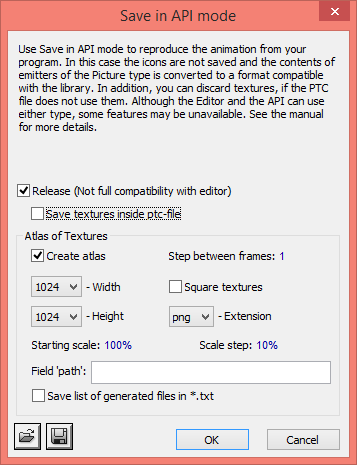

#Particles

[**oxygine-magicparticles**](https://bitbucket.org/oxygine/oxygine-magicparticles) is extension for oxygine-framework. It is based on commercial particles library [**Magic Particles**](http://astralax.com/).

 
##Usage

Install **Magic Particles 3D (Dev) Free**.

Create and export your particles (Save for API mode):

Copy exported files to data folder and add reference to resources xml file:

	<magicparticles file="particles/effects.ptc"/>

Include headers:

	#include "MagicEmitter.h"
	#include "ResMagicParticles.h"

Initialize particles:

	ResMagicParticles::init();

Create Emitter actor:

	ResMagicParticles *rs = gameResources.getT<ResMagicParticles>("effects");
	const ResMagicEmitter *mpem = rs->getEmitter("emitter_id");

	spMagicEmitter em = new MagicEmitter;

	em->attachTo(getRoot());
	em->setPosition(pos);
	em->setEmitter(mpem);
	em->setAutoDetach(true);

Where *emitter_id* is unique identifier of emitter created in the *Magic Particles Editor*.

	 