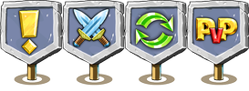

#Resources

Oxygine has three common types of resources:
 
* image
* font
* *atlas*

 
All resources used in your application should be declared in special xml files.

Here is simple xml example:

	<resources>

		<set path = "menu" />
		<atlas>
			<image file="close.png" />
			<image file="button.png" />		
			<image file="anim/run.png" />
		</atlas>

	</resources>

It means: 

* Generate atlas for group of images *menu/close.png, menu/anim/run.png, menu/button.png* into one atlas. 
* Image "close.png" would be accessible "close"
* Image "run.png" has 7 columns = 7 frames of single animation
* Image "button.png" has 3 columns = 3 frames

> You could have more than one *< atlas >* blocks.

These resources would available in your application when you load xml. 
You could access to them by id:

	Resources menu;

	void initMenu()
	{
		menu.loadXml("res.xml");
		ResAnim *resClose = menu.getResAnim("close");
		spSprite close = new Sprite;
		close->setResAnim(resClose);
	}

> It is recommended to have many small xml files instead of the big one.
	
	
##< Atlas >
Atlas could have own id and format attribute:

	<atlas format="565" id="some_id">

Supported formats:

* **8888** is set by default. Each channel has 8 bits
* **565**, where R=5, G=6, B=5 bits, no alpha
* **5551**, where R=5, G=5, B=5, A=1 bits
* **4444**, where R=4, G=4, B=4, A=4 bits

**format** option could be applied only to atlases generated in runtime or atlases without compression.

By default, atlases are being generating in runtime. Oxygine has own tool to generate them before running application.   
	

##< Image >

Each < image > should be declared only in **< atlas >**.

###ID attribute
ID's are **not** case sensitive.

**ID** is optional attribute. By default, it would be set too value equal to filename without extension:

	<image id="optional" file="path/to/filename.png" />

> You could set custom id to any type of resource (not only image). 

###Cols and Rows attributes

**Cols** defines number of columns in image. 
**Rows** defines number of rows in image.

	<image .... cols = "3" rows = "2" />

You could store multiple frames in one image.

This pseudo code demonstrates usage of image with four columns and connecting it with game logic:

	<image file="flags.png" cols="4" />
    

	enum state
	{
		state_new = 0, 
		state_fight = 1, 
		state_refresh = 2,
		state_pvp = 3
	}
	
	state state = getLocationState();
	int column = state; 
	locationSprite->setResAnim(resources.getResAnim("flags"), column);

###User data attributes
Any type of resource could have custom user data associated with it. Custom attributes could have any name (except already reserved).

	<image .... anim-delay = "123" offset-x = "200"/>

Access to them:

	ResAnim *rs = resources.getResAnim("anim");
	int time = rs->getAttribute("anim-delay").as_int(0);
	int offset = rs->getAttribute("offset-x").as_int(0);

> You could set user data to any type of resource (not only image).

##Paths
Path to the current folder where resources should be found could be set in xml with:
 
	<set path = "path/to/folder" />

Path could be also set relative to the current xml. It should begin with **"./"**:

	path = "./../images"

##< Starling> / Sparrow atlas format

Oxygine supports atlas format exported for Starling/Sparrow framework. 
Declare it in the resources xml:
 
	<starling file="atlas.xml" />

Then use as usual resource:

	ResAnim *rs = resources.getResAnim("image");

